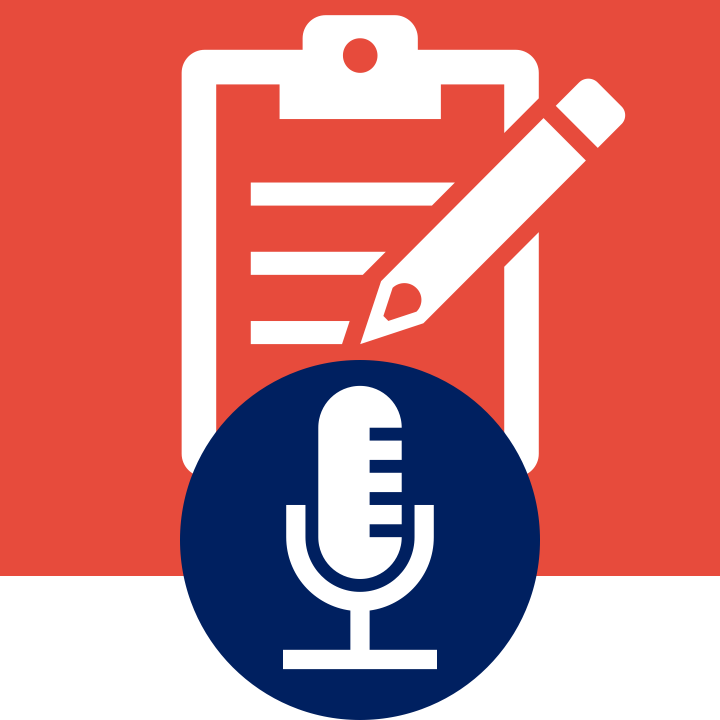

<h2> Autoscriber </h2>

| [GitHub Org](https://github.com/autoscriber-app) | [Frontend Repo](https://github.com/autoscriber-app/autoscriber-app.github.io) | [Backend Repo](https://github.com/autoscriber-app/autoscriber-app-backend) | [Summarizer Repo](https://github.com/autoscriber-app/autoscriber-lib) |

### What is Autoscriber?

Autoscriber is a progressive web app (PWA) that listens to your microphone audio, transcribes your speech, and summarizes your meeting in bullet point format. During the meeting, participants simply open a session link and turn on their microphone. Once the meeting is over, Autoscriber will use AI language models to analyze the conversation and jot down important sentences automatically.

### Who made this?

**Primary Developers**

| Kento Nishi | Keshav Pradeep | Sangmin Chun |
| :------------: | :------------: | :------------: |
|  |  | <a href="https://github.com/saggins"> |

Autoscriber was made by the 2020-2021 [Lynbrook Web Development Club](https://lhswebdev.github.io/).

### How do I use Autoscriber?

Create A Meeting

- Simply click "Create a New Session" on the home screen and answer the setup prompts.

Invite Others

- Click the "Copy" button to copy the invite link. Send the link to people you want to invite!

Turn on Your Microphone

- Tap the microphone button to record your speech during the meeting.

Generate Notes

- The meeting will automatically terminate once the host disconnects or clicks the "End the Session" button. Afterwards, Autoscriber's servers will process the recorded speech. Once processing is complete, you will be able to download bullet point notes as a Markdown file!
- **Notice**: Meeting notes will be stored for **30 days** before being permanently removed from our database. Make sure to download your notes before then.

### Other Info

The entire app (frontend, backend, processing library) are all open source [on our GitHub organization](https://github.com/autoscriber-app). Feel free to contribute!
